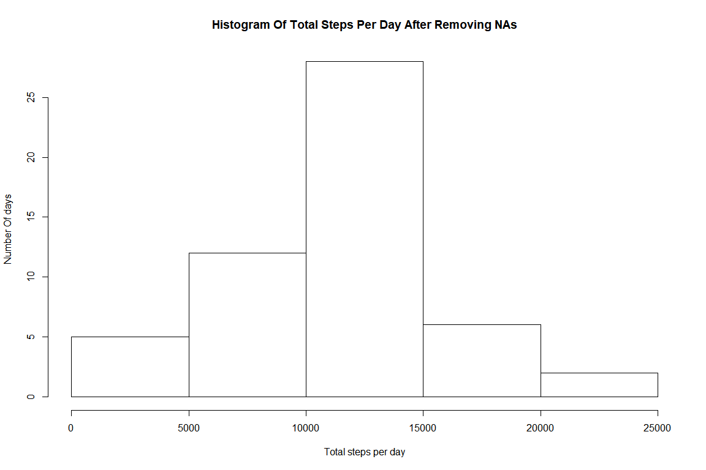

## Loading and preprocessing the data

The data file is in the zip format so first we unzip it and then read to get the data.


```r
unzip("activity.zip", exdir = ".")
activityData <- read.csv("activity.csv")
```

Before starting the analysis let's have a look at the structure, summary, few records of the dataset to get a better understanding of the data.


```r
summary(activityData)
```

```
     steps                date          interval     
 Min.   :  0.00   2012-10-01:  288   Min.   :   0.0  
 1st Qu.:  0.00   2012-10-02:  288   1st Qu.: 588.8  
 Median :  0.00   2012-10-03:  288   Median :1177.5  
 Mean   : 37.38   2012-10-04:  288   Mean   :1177.5  
 3rd Qu.: 12.00   2012-10-05:  288   3rd Qu.:1766.2  
 Max.   :806.00   2012-10-06:  288   Max.   :2355.0  
 NA's   :2304     (Other)   :15840                   
```
Intervals have a duration of 5 minutes each and every date has 288 intervals. There are 2304 NA's in steps, because median of steps is 0.00 it suggests that the data is right skewed and most of time person remains inactive.


```r
View(activityData)
```
Every hour is divided into 12 intervals of 5 minute starting from 0 to 55. Every interval comprises of hour and starting minute.(like 135 replresents 1:35 hrs)


```r
str(activityData)
```

```
'data.frame':	17568 obs. of  3 variables:
 $ steps   : int  NA NA NA NA NA NA NA NA NA NA ...
 $ date    : Factor w/ 61 levels "2012-10-01","2012-10-02",..: 1 1 1 1 1 1 1 1 1 1 ...
 $ interval: int  0 5 10 15 20 25 30 35 40 45 ...
```
<br></br>
The *date* is stored as Factor so it would be better if we convert it into a Date class so that we can use lubridate package for day, week, month manipulation.


```r
library(lubridate)
activityData$date <-ymd(activityData$date) 
```

## What is mean total number of steps taken per day?

We see distribution of steps taken per day in a histogram:


```r
library(dplyr)
totalActivityPerDay <- activityData %>% 
  group_by(date)%>% 
  summarize(total_steps_per_day = sum(steps,na.rm = TRUE))

hist(totalActivityPerDay$total_steps_per_day, border = TRUE, xlab = "Total steps per day",ylab = "Number Of days", main="Histogram Of Total Steps Per Day")
```

<!-- -->
Histogram shows a lot of variation in the steps taken on different days. 
Now we calculate the mean and median of total steps taken per day during the entire period of monitoring


```r
summ <- totalActivityPerDay %>% 
  summarise(mean_steps_per_day=mean(total_steps_per_day),
            median_steps_per_day = median(total_steps_per_day))
```
The average number of steps taken per day is 9354.2295082 and median is 10395. 

## What is the average daily activity pattern?

Here, we see on an average how many steps are taken in different intervals daily. We draw a time plot for average number of steps taken in every interval of 5 minutes (starting at 0 and  ending at 2355 minutes) during the monitoring period of 2 months.  


```r
timeData <- activityData %>%
  group_by(interval) %>%
  mutate(averageSteps=sum(steps,na.rm = TRUE)/n())
with (timeData, 
      plot(x= interval, y= averageSteps, type="l", xlim = c(0,2355)))
```

<!-- -->

```r
maxstepInterval <- timeData$interval[which.max(timeData$averageSteps)] 
hr <- maxstepInterval%/%100
min <- maxstepInterval%%100
```
During the five minute interval that starts at 8:35 hrs maximum average steps are taken daily.  

## Imputing missing values
There are *(NA's   :2304  )* instances when number of steps can't be recorded in the dataset so we replace these missing (NA) values by the mean steps taken in five minutes's interval in that particular day. 


```r
#Adding a temperary column for average steps in 5 minute interval in a day
activityDataWON <- activityData %>%
  group_by(date) %>%
  mutate(avgSteps = sum(steps, na.rm=TRUE)/n())

#Replace NA value by average steps in the day 
for(i in which(is.na(activityDataWON$steps))){
  activityDataWON$steps[i]=activityDataWON$avgSteps[i]
}

#Drop the temporary column avgSteps by selecting others 
activityDataWON <- select(activityDataWON, steps, date, interval)
totalActivityPerDayWON <- activityData %>% group_by(date)%>% summarise(total_steps_per_day=sum(steps))
hist(totalActivityPerDayWON$total_steps_per_day,border = TRUE, xlab = "Total steps per day",ylab = "Number Of days", main="Histogram Of Total Steps Per Day After Removing NAs")
```

<!-- -->
<br></br> As we can see, after imputing NAs by the mean steps of that day, height of first bin (0-5000)decreased and  height of third bin(10000=15000) is increased. 

## Are there differences in activity patterns between Days and weekends?

To answer this question, we separate data into two partitions "DaysData" and "weekendsData"

```r
library(ggplot2)
library(lubridate)
#Days starts with Monday and Saturday and Sundays are WeekEnds
weekData <- activityDataWON %>%
  mutate(Days=ifelse(wday(date,week_start = 1)<6,"Weekdays","Weekends"))%>%
  group_by(Days,interval)%>% 
  summarise(meanSteps=mean(steps))

ggplot(weekData, aes(x=interval, y=meanSteps))+geom_line()+facet_grid(weekData$Days~.)
```

<!-- -->


```r
weekData%>% 
  group_by(Days)%>% 
  summarise(
    maxSteps=max(meanSteps),
    maxAt=interval[which.max(meanSteps)],
    minSteps=min(meanSteps),
    minAt=interval[which.min(meanSteps)],
    meanAverageSteps=mean(meanSteps),
    totalSteps=sum(meanSteps) )
```

```
# A tibble: 2 x 7
  Days     maxSteps maxAt minSteps minAt meanAverageSteps totalSteps
  <chr>       <dbl> <int>    <dbl> <int>            <dbl>      <dbl>
1 Weekdays      203   835        0    40             30.6       8820
2 Weekends      153   915        0     0             37.7      10856
```
<br></br> We can see a clear difference between the activity patterns during Days and during weekends. 
The person remains more active in weekends as it takes on average 10856 steps in comprarion to 8820 steps on weekdays. The maximum value of average steps in any interval is observed in weekdays at 8:35 hrs. Average value of steps taken is higher in weekend by around 7 steps per interval. 
